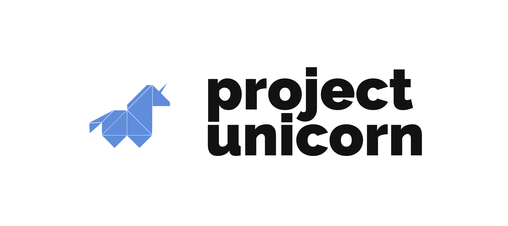

<p align="center">
  
</p>

<p align="center">
  <a href="https://travis-ci.com/projectunic0rn/pub">
    
  </a>

  <a href="https://projectunicorn.net/">
    
  </a>
</p>

<br />

## Quick start

```bash
git clone https://github.com/projectunic0rn/pub-api.git
cd pub-api/src/Pub

# Install dependencies
dotnet restore

# Run tests
dotnet test

# Develop
dotnet run --project API
```

## Directory Layout


    .
    ├── .github                 # GitHub files
    ├── docs                    # Documentation files
    ├── src                      
    │   ├── Pub          
    │   |   ├── API              # Service layer, code describing rest endpoints
    │   |   ├── Domain           # Domain layer, code describing domain objects/logic/validation
    │   |   ├── Infrastructure   # Persistence layer, code persisting to storage or message bus
    │   |   └── Tests            # Automated tests
    ├── infrastructure           # Infrastructure as code deployment scripts                      
    ├── ci                       # Continuous integration, build scripts                      
    └── README.md

## Documentation
- [Docs](./docs)
- [Contributing Guide](./CONTRIBUTING.md)
